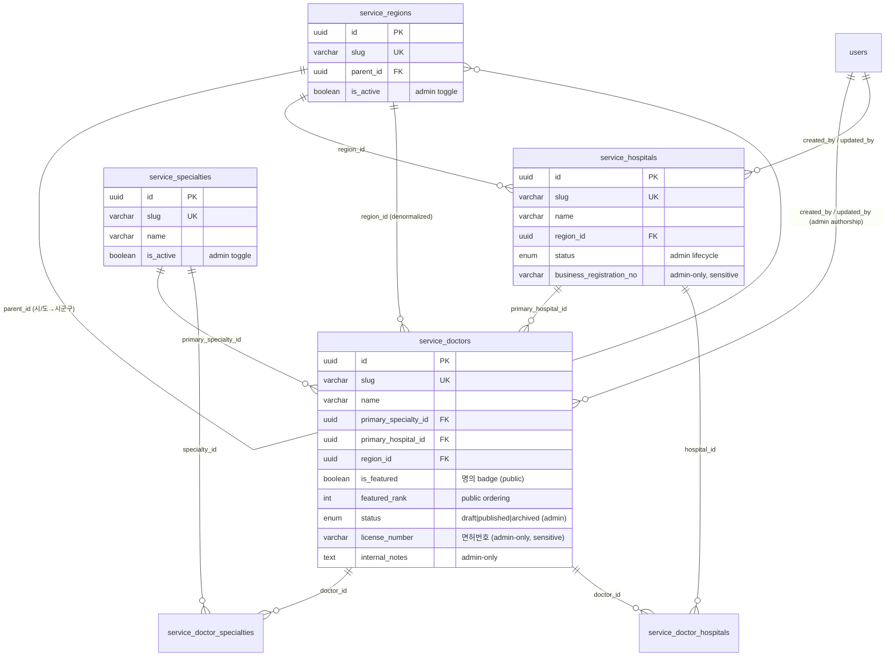

# PB-DATA-001 — 서비스 도메인 데이터 모델 (의사/병원 큐레이션)

- Issue: `BBR-519` `[PB-DATA-001]`
- Build: `bp-0b891299-66b7-438f-a3a4-7a63fbf8632b` · Blueprint: `온라인 서비스` (`online-service-standard`)
- Capability: `domain.service-schema` · Decision: **NEW** · Role: Data Engineer
- Depends on: PB-API-001 (REST/OpenAPI contract), PB-AUTH-002, PB-FEAT-003 (scope lock, BBR-495 done)
- Schema module: `packages/drizzle/src/schema/features/service-domain/`
- Migration: `packages/drizzle/migrations/0046_service_domain.sql`
- Seed: `packages/drizzle/src/seed/service-domain.ts` (`pnpm --filter @repo/drizzle db:seed:service-domain`)

## 1. Service type & scope

AIGA's selected service type is **의사/병원 큐레이션** (doctor / hospital curation): the public
discovers 명의(renowned doctors), 의사 프로필, and 병원 상세; an admin curates the editorial
catalog. This issue (PB-DATA-001) is the **공통 선행 / shared core hub** for the per-feature
DATA clusters locked in PB-FEAT-003 (BBR-495). It owns the central catalog entities and the
shared taxonomy; per-FR clusters reference these tables and add their own feature-specific
schema in their own modules (see §6 ownership boundary).

## 2. Domain resource map

| Resource (table) | Korean | Kind | Owned here | Referenced by |
|------------------|--------|------|-----------|---------------|
| `service_specialties` | 진료과 | shared taxonomy | ✅ PB-DATA-001 | FR-003 검색, FR-004 명의, FR-005 프로필 |
| `service_regions` | 지역 (2-level 시/도→시군구) | shared taxonomy | ✅ PB-DATA-001 | FR-003 검색, FR-004, FR-005 |
| `service_hospitals` | 병원 (FR-006 folded) | core editorial resource | ✅ PB-DATA-001 | FR-003, FR-005 |
| `service_doctors` | 의사 | **central hub** editorial resource | ✅ PB-DATA-001 (core record) | FR-002 개인화, FR-003, FR-004, **FR-005 extends** |
| `service_doctor_specialties` | 의사↔진료과 | M:N link | ✅ PB-DATA-001 | FR-003, FR-004 |
| `service_doctor_hospitals` | 의사↔병원 | M:N affiliation | ✅ PB-DATA-001 | FR-003, FR-005 |

> FR-006 병원 상세 has **no separate DATA cluster** (PB-FEAT-003 lock: REUSE→FR-005); its data
> lives in `service_hospitals` here. Hospital/doctor detail *surfaces* (SEO pages, admin edit) are
> tracked by the FR-005 surface/QA issues, not duplicated as schema.

## 3. ERD

## 4. Public / Private / Admin field separation (AC#2)

Only `status = 'published'` rows are exposed on public surfaces (`apps/site`). Within a published
row, fields are partitioned by viewer. Soft-delete (`is_deleted`/`deleted_at`) rows are never public.

| Table | Public fields | Admin-only fields |
|-------|---------------|-------------------|
| `service_doctors` | name, slug, title, primary_specialty_id, primary_hospital_id, region_id, short_bio, biography, photo_url, years_experience, rating_avg, review_count, is_featured, featured_rank | status, **license_number** (면허번호), license_verified_at, internal_notes, source_url, created_by, updated_by, is_deleted, deleted_at |
| `service_hospitals` | name, slug, summary, description, region_id, address_line, phone, website_url, photo_url, rating_avg, review_count, is_featured | status, **business_registration_no** (사업자번호), internal_notes, source_url, created_by, updated_by, is_deleted, deleted_at |
| `service_specialties` | name, slug, description, sort_order | is_active |
| `service_regions` | name, slug, parent_id, sort_order | is_active |

**Status / lifecycle semantics** (`service_publish_status`):

| Status | Public visible? | Meaning |
|--------|-----------------|---------|
| `draft` | ❌ | Editorial work-in-progress; admin console only. |
| `published` | ✅ | Live on public surfaces. |
| `archived` | ❌ | Retired; preserved for admin/audit, referenced links intact. |

> Enforcement is at the query layer: public read paths filter `status = 'published' AND is_deleted = false`
> and select only the public column set; admin read paths see all rows/columns. The schema makes the
> separation explicit (column grouping + comments) so API/UI issues cannot accidentally leak admin fields.

## 5. Index catalog → query pattern (AC#1)

Public 조회 (browse/search) and admin 편집 (console) query patterns are both indexed.

| Index | Table | Serves |
|-------|-------|--------|
| `uq_service_doctors_slug` | doctors | public detail by slug (`/doctors/{slug}`) + uniqueness |
| `idx_service_doctors_status_specialty` | doctors | public browse: published doctors by 진료과 |
| `idx_service_doctors_status_region` | doctors | public browse: published doctors by 지역 |
| `idx_service_doctors_status_featured_rank` | doctors | public **명의 rail**: published + featured in rank order (verified `Index Scan`) |
| `idx_service_doctors_hospital` | doctors | doctors at a hospital (병원 상세) |
| `idx_service_doctors_name` | doctors | name prefix/search |
| `idx_service_doctors_updated_at` | doctors | **admin console**: most-recently-edited first |
| `uq_service_hospitals_slug` | hospitals | public detail by slug + uniqueness |
| `idx_service_hospitals_status_region` | hospitals | public browse: published hospitals by 지역 |
| `idx_service_hospitals_status_featured` | hospitals | public featured hospitals rail |
| `idx_service_hospitals_name` | hospitals | name prefix/search |
| `idx_service_hospitals_updated_at` | hospitals | **admin console** ordering |
| `uq_service_specialties_slug` / `idx_service_specialties_active_order` | specialties | public category list (active, ordered) |
| `uq_service_regions_slug` / `idx_service_regions_parent_order` / `idx_service_regions_active` | regions | public region drill-down |
| `idx_doctor_specialties_specialty` | doctor_specialties | reverse lookup: doctors in a specialty |
| `idx_doctor_hospitals_hospital` | doctor_hospitals | reverse lookup: doctors at a hospital |

## 6. Ownership boundary — downstream FR clusters EXTEND, do not redefine

| FR cluster | DATA issue | Adds (its own module) | Reuses from here |
|------------|-----------|------------------------|------------------|
| FR-001 등급·메터링 | BBR-520 | user tier attribute + daily usage-limit/metering tables (user-owned) | — (user, not catalog) |
| FR-002 개인화 | BBR-732 | user saves/favorites/history referencing `service_doctors`/`service_hospitals` | doctor/hospital ids |
| FR-003 통합검색 | BBR-521 | search projection/index over catalog | doctors, hospitals, specialties, regions |
| FR-004 명의 큐레이션 | BBR-522 | curated collections (명의 lists) referencing doctors | `service_doctors`, `is_featured` |
| FR-005 의사 프로필 | BBR-523 | rich profile detail (career/education/awards) extending `service_doctors` | `service_doctors`, `service_hospitals` |

**Rule:** FR clusters reference these tables by id and add columns/sub-tables in their own modules.
They must not redefine the core doctor/hospital/taxonomy tables. "사용자 소유 데이터"(user-owned
saves/tiers) is owned by FR-001/FR-002, not by this shared catalog hub.

## 7. Migration & verification evidence

- **Migration** `0046_service_domain.sql` is hand-authored in the repo's idempotent style
  (`CREATE TYPE … EXCEPTION WHEN duplicate_object`, `CREATE TABLE/INDEX IF NOT EXISTS`,
  `ADD CONSTRAINT` in `DO` guards) — `drizzle-kit generate` was **not** used because the base
  migration snapshot (`migrations/meta`) carries pre-existing unrelated drift that would be swept
  into this migration. Journal entry `idx: 46` appended.
- Verified against an **ephemeral Postgres 16** (Docker):
  - migration applies clean and is **idempotent** on re-run;
  - 6 tables, `service_publish_status` enum = {draft, published, archived}, 13 FKs, 25 indexes;
  - seed runs and is idempotent (6 specialties · 3 regions · 2 hospitals · 3 doctors incl. 1 featured 명의 · 3+3 links);
  - public projection join returns published doctors (명의 first); **featured-rail query uses `idx_service_doctors_status_featured_rank` (`Index Scan`)**; admin-only `license_number`/`internal_notes` decoupled from the public payload.
- `pnpm --filter @repo/drizzle check-types` passes.

## 8. Handoff

- **PB-INFRA-002** (BBR-524) owns migration *proof against live Neon* + connectivity; this issue
  delivers the reviewable DDL + offline verification. Apply via `pnpm --filter @repo/drizzle db:migrate`
  (or `db:push` for dev) once the Neon branch is connected (PB-INFRA-001 / BBR-499).
- **FR clusters** (BBR-520/521/522/523/732) are unblocked to build their feature schema on top of
  this hub per §6.
