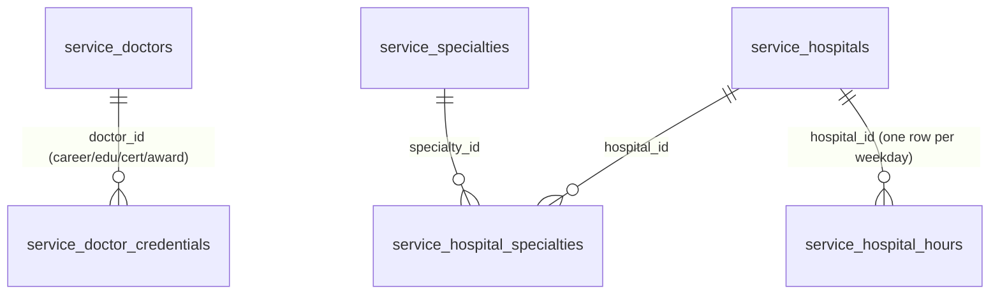

# PB-DATA-FR-005 — 프로필 데이터 모델 (의사 프로필 · 병원 상세)

- Issue: `BBR-523` `[FEAT-FR-005-DATA]`
- Build: `bp-0b891299-66b7-438f-a3a4-7a63fbf8632b` · Blueprint: `온라인 서비스` (`online-service-standard`)
- Capability: `domain.feature.fr-005.data` · Decision: **NEW** · Role: Data Engineer
- Depends on: **PB-FEAT-003** (scope lock, BBR-495 done), **PB-DATA-001** (core hub, BBR-519 merged → main)
- Schema module: `packages/drizzle/src/schema/features/service-domain/` (`credentials.ts`, `hospital-details.ts`)
- Migration: `packages/drizzle/migrations/0051_service_domain_profile.sql`
- Seed: `packages/drizzle/src/seed/service-domain.ts` (`pnpm --filter @repo/drizzle db:seed:service-domain`)

## 1. Scope

기능 카드 **"프로필"** (MVP, 영역: 어플리케이션) — *의사 프로필 및 병원 상세 조회*.

PB-DATA-001 (BBR-519) built the shared **core hub** (`service_doctors`, `service_hospitals`,
taxonomy, M:N links) and deliberately left the **rich profile/detail content** to FR-005 (see the
`service_doctors` header note). This issue EXTENDs the hub by reference — it does **not** redefine
the core record — adding the detail tables that back the two detail pages:

- **의사 프로필 상세** — career / education / certification / award timeline.
- **병원 상세** — FR-006 has no separate DATA cluster (PB-FEAT-003 lock: **REUSE→FR-005**), so its
  detail data (진료과목 department list, 운영시간 weekly hours) lives here alongside FR-005.

## 2. Resource map (added by FR-005)

| Resource (table) | Korean | Kind | FR | Parent (FK) |
|------------------|--------|------|----|-------------|
| `service_doctor_credentials` | 의사 프로필 이력 | detail timeline (1:N) | FR-005 | `service_doctors` (cascade) |
| `service_hospital_specialties` | 병원 진료과목 | M:N department link | FR-006→FR-005 | `service_hospitals`, `service_specialties` (cascade) |
| `service_hospital_hours` | 병원 운영시간 | weekly schedule (1:N) | FR-006→FR-005 | `service_hospitals` (cascade) |

Enum (FR-005-owned, in `credentials.ts`): `service_doctor_credential_kind` =
`education | career | certification | award`.

> Editorial lifecycle stays on the parent (`service_publish_status` on `service_doctors` /
> `service_hospitals`). Child rows are public only when the parent is `published`; the public API
> joins on the parent status. No new lifecycle enum is introduced.

## 3. ERD

## 4. Tables, fields & status

### 4.1 `service_doctor_credentials` (의사 프로필 이력)

| Column | Type | Notes |
|--------|------|-------|
| `id` | uuid PK | |
| `created_at` / `updated_at` | timestamptz | base columns |
| `doctor_id` | uuid FK → `service_doctors` | `on delete cascade` |
| `kind` | `service_doctor_credential_kind` | section discriminator |
| `title` | varchar(200) NOT NULL | 항목 제목 |
| `organization` | varchar(200) | 소속/발급 기관 (nullable) |
| `start_year` / `end_year` | integer | structured sort keys; `end_year` null = 현재/단일시점 |
| `display_period` | varchar(80) | 표시용 기간 라벨 (e.g. "2008–현재") |
| `description` | text | optional 상세 |
| `sort_order` | integer default 0 | kind 섹션 내 정렬 |
| `is_visible` | boolean default true | **admin-only** 개별 항목 숨김 |

Indexes: `idx_doctor_credentials_doctor_kind_order (doctor_id, kind, sort_order)`,
`idx_doctor_credentials_doctor_visible (doctor_id, is_visible)`.

### 4.2 `service_hospital_specialties` (병원 진료과목, M:N)

| Column | Type | Notes |
|--------|------|-------|
| `hospital_id` | uuid FK → `service_hospitals` | composite PK, cascade |
| `specialty_id` | uuid FK → `service_specialties` | composite PK, cascade |
| `sort_order` | integer default 0 | detail page 진료과목 정렬 |

PK `(hospital_id, specialty_id)`; indexes `idx_hospital_specialties_hospital_order`,
`idx_hospital_specialties_specialty`.

### 4.3 `service_hospital_hours` (병원 운영시간)

| Column | Type | Notes |
|--------|------|-------|
| `id` | uuid PK | |
| `created_at` / `updated_at` | timestamptz | base columns |
| `hospital_id` | uuid FK → `service_hospitals` | cascade |
| `day_of_week` | integer | 0 = Sun … 6 = Sat (JS `getDay()`) |
| `opens_at` / `closes_at` | varchar(5) | "HH:MM" 벽시계; null when closed |
| `is_closed` | boolean default false | 휴진 |
| `note` | varchar(120) | e.g. "점심시간 13:00–14:00" |

Unique `uq_hospital_hours_hospital_day (hospital_id, day_of_week)` — one row per weekday.

## 5. 공개 / private / admin 필드 분리 (acceptance criteria)

| Surface | Visible fields | Gate |
|---------|----------------|------|
| **public** (apps/site 의사·병원 상세) | credentials: `kind, title, organization, start_year, end_year, display_period, description, sort_order` · hospital specialties: all · hospital hours: all | parent `status = 'published'` **AND** (credentials) `is_visible = true` |
| **admin** (관리자 편집) | + `is_visible` toggle, draft/archived parents, soft-deleted parents | authenticated admin |

No sensitive PII is stored in the FR-005 tables — 의사 면허번호/사업자등록번호 등 민감정보는 코어
허브의 admin-only 컬럼(`service_doctors.license_number`, `service_hospitals.business_registration_no`)에
남는다. The public detail API must filter on the parent published status and (for credentials)
`is_visible`.

## 6. Seed

`db:seed:service-domain` is extended (idempotent):

- **credentials** — education/career/certification/award entries for the 3 seeded doctors
  (featured 명의 김정호 gets all four kinds). Guarded per-doctor (insert only when none exist).
- **hospital specialties** — 서울중앙메디컬센터 = 정형외과/심장내과/신경외과, 송파웰니스병원 =
  피부과/가정의학과 (`onConflictDoNothing` on composite PK).
- **hospital hours** — weekday 09:00–18:00 (점심 13–14), Sat varies, Sun 휴진
  (`onConflictDoNothing` on `(hospital_id, day_of_week)`).

## 7. Ownership boundary

FR-005 owns only the three tables above and the `service_doctor_credential_kind` enum. It
references the PB-DATA-001 hub (`service_doctors`, `service_hospitals`, `service_specialties`) by
id and never redefines those tables. Downstream FR-005 **API** issues (BBR-541..545) read these
tables; the FR-005 **APP** issue (BBR-584) renders the detail pages; **QA** is BBR-494.
