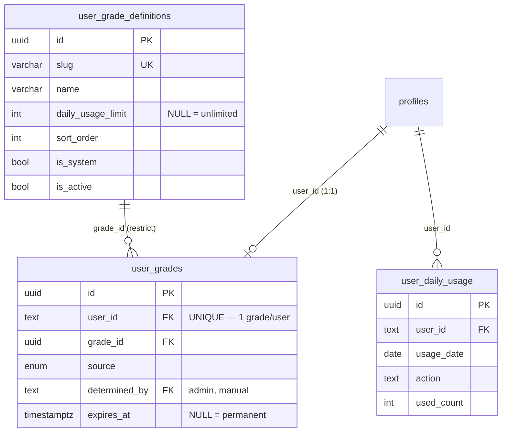

# PB-DATA-FR001-001 — 사용자 데이터 모델 (소셜 로그인 · 등급 · 일일 한도)

- Issue: `BBR-520` `[FEAT-FR-001-DATA]`
- Build: `bp-0b891299-66b7-438f-a3a4-7a63fbf8632b` · Blueprint: `온라인 서비스` (`online-service-standard`)
- Capability: `domain.feature.fr-001.data` · Decision: **NEW** · Role: Data Engineer
- Depends on: PB-FEAT-003 (scope lock, BBR-495 done), PB-DATA-001 (shared core hub, BBR-519 merged #11)
- Schema module: `packages/drizzle/src/schema/features/user-grade/`
- Migration: `packages/drizzle/migrations/0047_user_grade.sql`
- Seed: `packages/drizzle/src/seed/user-grade.ts` (`pnpm --filter @repo/drizzle db:seed:user-grade`)

> Path note: the issue names `apps/api` as the target, but this delivery monorepo (selected by
> PB-REPO-001) keeps all relational schema/migrations in `packages/drizzle` — where the direct
> dependency PB-DATA-001 lives. This cluster follows that established location.

## 1. Feature scope

Feature card **"사용자"** (MVP, 영역: 어플리케이션):

> 소셜 로그인 및 사용자 등급 판정 / 사용자 등급별 일일 사용 한도 적용

Two capabilities, with different build decisions:

1. **소셜 로그인** — identity (Google/Kakao/Naver), accounts, sessions → **REUSE** (core).
2. **사용자 등급 판정 + 등급별 일일 사용 한도** → **NEW** (this cluster).

## 2. REUSE / N/A map (what this cluster does NOT re-create)

| Concern | Decision | Where it already lives | Why not re-created |
|---------|----------|------------------------|-------------------|
| Social login / accounts / sessions | **REUSE** | `core/better-auth` (`users`, `sessions`, `accounts`), `core/profiles.authProvider` (email/google/naver/kakao/linkedin) | AIGA selected kakao+naver; base already implements the OAuth providers (PB-AUTH-OAUTH-KAKAO). |
| User identity / public profile | **REUSE** | `core/profiles` (name, handle, bio, avatar, isActive) | Public profile fields exist; grade is layered on top by `user_id`. |
| RBAC roles / permissions | **REUSE** | `core/role-permission` (`roles`, `user_roles`, …) | Grade ≠ role. Role = permission scope (guest/member/admin); grade = usage tier driving quota. Kept separate on purpose. |
| Sliding-window rate limiting | **REUSE** | `core/rate_limits` (event rows) | Abuse prevention. The per-grade **daily quota** is a distinct per-day aggregate — see `user_daily_usage` (§4). |
| 본인확인 (identity gate) | **REUSE / external** | `features/identity-verification` (KCB, PB-IDV-KCB-*) | Verification result *bumps* grade (`source = identity_verified`); the gate itself is not owned here. |

## 3. NEW resources (owned by FR-001)

| Resource (table) | Korean | Kind | Notes |
|------------------|--------|------|-------|
| `user_grade_definitions` | 등급 정의 | admin-managed catalog | grade slug/name + `daily_usage_limit` (NULL = unlimited) |
| `user_grades` | 사용자 등급 판정 결과 | per-user (1:1) | current grade + 판정 근거(`source`) + optional `expires_at` |
| `user_daily_usage` | 일일 사용량 집계 | per (user, day, action) | counter enforced against the grade's `daily_usage_limit` |
| enum `user_grade_source` | 판정 근거 | enum | `signup` / `identity_verified` / `manual` / `system` |

## 4. ERD

## 5. 공개 / private / admin 필드 분리 (acceptance criteria)

| Table | public | app (own user) | private / admin-only |
|-------|--------|----------------|----------------------|
| `user_grade_definitions` | `name`, `slug`, `description`, `sort_order` | (resolved grade label/limit) | `daily_usage_limit`, `is_system`, `is_active` |
| `user_grades` | — | `grade_id` (→ badge) | `source`, `determined_by`, `note`, `expires_at` |
| `user_daily_usage` | — | own `used_count` vs limit | all rows (admin usage view) |

- Public surfaces (apps/site) expose only grade **labels** (badge), never the limit config, the
  판정 근거, or another user's usage — satisfying "공개 필드와 private/admin 필드가 분리".
- The grade catalog supports 공개(badge)/앱(quota display)/관리자(limit tuning) requirements.

## 6. Determination & enforcement (data contract, app-owned logic)

- **판정 (determination):** on social-login signup → insert `user_grades` with `source=signup`,
  `grade_id` = `basic`. On KCB pass → update to `verified`, `source=identity_verified`. Admin
  override → `source=manual` + `determined_by` + `note`. (1 row/user enforced by `uq_user_grades_user`.)
- **한도 적용 (enforcement):** on a protected action, resolve the user's grade →
  `daily_usage_limit`; `INSERT ... ON CONFLICT (user_id, usage_date, action) DO UPDATE SET
  used_count = used_count + 1` and reject when the new count exceeds the limit. `usage_date` (UTC)
  is the daily reset boundary. NULL limit = unlimited (premium).

## 7. Seed (system grades)

| slug | name | daily_usage_limit | when assigned |
|------|------|-------------------|---------------|
| `guest` | 게스트 | 5 | anonymous-equivalent fallback |
| `basic` | 기본 회원 | 20 | social-login signup |
| `verified` | 인증 회원 | 100 | after KCB 본인확인 |
| `premium` | 프리미엄 회원 | ∞ (NULL) | premium tier |

All seeded `is_system=true`, idempotent on `slug`.

## 8. Indexes

- `uq_user_grade_definitions_slug`, `idx_user_grade_definitions_active_order` (active grades in order)
- `uq_user_grades_user` (1 grade/user + lookup), `idx_user_grades_grade`, `idx_user_grades_expires_at` (expiry sweep)
- `uq_user_daily_usage_user_date_action` (enforcement key + 1 counter/day/action), `idx_user_daily_usage_date` (retention)

## 9. Cross-agent integration note

Several FR DATA clusters were authored concurrently and each added a `0047_*` migration. Migration
**file** prefixes may duplicate (the repo already tolerates this — see `0026_*`, `0035_*`), but the
drizzle journal `idx` must be unique. Whichever PR merges second must renumber its journal entry
(and may rename its `.sql`) — a mechanical merge-time reconciliation, not a schema conflict, since
the table sets are disjoint.
