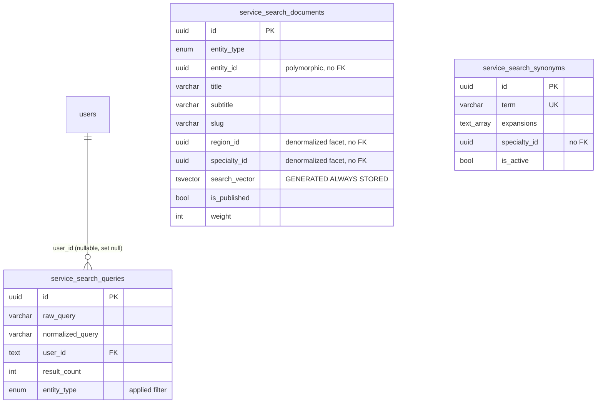

# PB-DATA-FR003 — 통합검색 데이터 모델 (Unified search)

- Issue: `BBR-521` `[FEAT-FR-003-DATA]`
- Build: `bp-0b891299-66b7-438f-a3a4-7a63fbf8632b` · Blueprint: `온라인 서비스` (`online-service-standard`)
- Capability: `domain.feature.fr-003.data` · Decision: **NEW** · Role: Data Engineer
- Depends on: PB-FEAT-003 (scope lock, BBR-495 done), PB-DATA-001 (service-domain hub, BBR-519 done / merged #11)
- Schema module: `packages/drizzle/src/schema/features/service-search/`
- Migration: `packages/drizzle/migrations/0048_service_search.sql` (renumbered from 0047 on rebase; sibling 0047_user_grade merged first)
- Seed: `packages/drizzle/src/seed/service-search.ts` (`pnpm --filter @repo/drizzle db:seed:service-search`)

## 1. Scope

도메인 기능 카드 **"통합"** (통합 검색, MVP·영역: 어플리케이션) 의 데이터 모델이다. 공개 방문자가
하나의 검색창에서 **의사·병원·진료과·지역을 한 번에** 검색하고, 로그인 사용자는 최근 검색어를,
관리자는 동의어/검색 분석을 관리하는 것이 목표다.

이 클러스터는 PB-DATA-001 의 카탈로그 허브를 **재정의하지 않는다**. 발행(published)된 카탈로그
행들을 하나의 검색 가능한 **투영(projection)** 으로 모으고, 검색 전용 리소스(동의어, 검색 로그)를
추가한다. 허브는 id 로만 참조한다(비정규화 facet 키, polymorphic `entity_id`).

## 2. Tables

| Table | Korean | Kind | Notes |
|-------|--------|------|-------|
| `service_search_documents` | 통합검색 인덱스 | rebuildable projection | doctor/hospital/specialty/region 1행/소스행, 생성형 `tsvector` |
| `service_search_synonyms` | 검색 동의어 | admin reference | term → expansions(text[]), 한국어 의료 동의어 |
| `service_search_queries` | 검색 로그 | append-only log | 인기 검색어·최근 검색어·zero-result 분석의 단일 소스 |

`service_search_entity_type` enum = `doctor | hospital | specialty | region`.

## 3. ERD

`service_search_documents` is a **denormalized projection**, not a source of truth: `entity_id`,
`region_id`, `specialty_id` are deliberately **FK-free** so the index can be rebuilt/refreshed
independently of the catalog and filtered search stays a single-table scan. The only FK is
`service_search_queries.user_id → users(id) ON DELETE set null`.

## 4. Public / private / admin field separation (acceptance criteria)

| Table | public (비로그인 노출 가능) | app (로그인 사용자 본인) | admin-only / internal |
|-------|---------------------------|------------------------|----------------------|
| `service_search_documents` | `entity_type, entity_id, title, subtitle, slug, photo_url, region_id, specialty_id, rating_avg` — **only `is_published = true`** | (동일) | `body, keywords, search_vector, weight, is_published, source_updated_at` (랭킹/인덱스 내부, raw 노출 금지) |
| `service_search_synonyms` | — (검색 랭킹에만 영향, 직접 노출 없음) | — | `term, expansions, specialty_id, is_active, notes` |
| `service_search_queries` | **집계만**: 인기 검색어 = `normalized_query` top-N count (개별 행 비노출) | 본인 최근 검색어 = `where user_id = self` | 원본 로그 전체 + zero-result 리포트(`result_count = 0`) |

공개 표면은 반드시 `is_published = true` 로 필터한다. 발행된 소스 행만 투영되지만, 컬럼으로 가드를
명시하여 소스 행 발행 취소 시 문서를 즉시 삭제하지 않고도 검색에서 숨길 수 있다.

## 5. Indexes & search strategy

- **Full-text**: `search_vector` 는 `title(A)/subtitle(B)/keywords(B)/body(C)` 가중치로 DB 생성
  (`GENERATED ALWAYS ... STORED`). `simple` config 사용 — 한국어는 번들 FTS 사전이 없어 공백/구두점
  토큰화를 쓰고, 부분문자열·오타 보정은 trigram 으로 보완한다. `GIN(search_vector)`.
- **Autocomplete / 오타 보정**: `pg_trgm` 확장 + `GIN(title gin_trgm_ops)` 로 `ILIKE '%…%'` 부분
  검색을 인덱싱한다.
- **Facet 필터**: `(is_published, entity_type)`, `region_id`, `specialty_id`, `(is_published, weight)`.
- **동의어 역참조**: `GIN(expansions)`.
- **로그 surface**: `(normalized_query, created_at)` 인기 검색어 · `(user_id, created_at)` 최근
  검색어 · `result_count` zero-result · `created_at` 기간 스캔.
- **랭킹**: `ts_rank(search_vector, query)` 에 `weight`(featured 명의/병원 = 100) 와 `rating_avg`
  를 결합해 정렬. drizzle-kit 0.38 은 `gin_trgm_ops` op-class 를 표현하지 못하므로 두 GIN 인덱스는
  마이그레이션에서만 생성한다(스키마 파일에 주석으로 명시).

## 6. Reindex strategy

`service_search_documents` 는 카탈로그의 보조 캐시다(서버 권위 데이터 정책과 일치). 재색인은
seed/runtime 모두 동일 로직을 쓴다:

1. 발행된 `service_doctors` / `service_hospitals` + 활성 `service_specialties` / `service_regions`
   를 읽는다.
2. 표시/검색 필드를 비정규화해 문서로 매핑한다(subtitle = 진료과·지역, keywords = 직함·진료과).
3. `(entity_type, entity_id)` 유니크 키로 **upsert** 한다 → 멱등, 제자리 갱신.

`source_updated_at` 으로 증분 재색인이 가능하다(변경된 소스 행만 다시 투영). 소스 행 발행 취소 시
`is_published = false` 로 내리거나 문서를 삭제한다.

## 7. Seed

`db:seed:service-search` (먼저 `db:seed:service-domain` 으로 카탈로그를 채운 뒤 실행):

- 동의어 6건(정형외과↔뼈/관절/척추 등) — `term` upsert.
- 재색인 → 문서 14건(의사 3 + 병원 2 + 진료과 6 + 지역 3).
- 데모 검색 로그 6건(인기 검색어 "무릎 관절"×2, zero-result "치과 임플란트") — 로그가 비어 있을 때만.

모두 멱등(`term` / `(entity_type, entity_id)` upsert, 로그는 빈 테이블에서만).

## 8. Verification (ephemeral Postgres 16)

`0046 → 0047 → 0048` 적용 + `0048` 재적용(전 구문 `CREATE … IF NOT EXISTS` / `DO … EXCEPTION` 멱등),
실제 TS seed 2종 실행 후:

- 통합 FTS: `to_tsquery('simple','정형외과')` → 의사 `김정호` + 진료과 `정형외과` 교차 매칭 ✅
- trigram 부분검색: `title ILIKE '%소연%'` → `이소연` ✅
- 랭킹: `ts_rank + weight` (featured 의사 weight=100) ✅
- 인기 검색어 집계 / zero-result 리포트 ✅
- `search_vector` = `GENERATED ALWAYS` (직접 insert 불가) ✅
- `GIN(search_vector)`, `GIN(title gin_trgm_ops)` 존재 ✅
- seed 재실행 시 문서 14건 유지(중복 없음) ✅
- `check-types` 통과, biome 에러 0(seed 의 console/length 경고는 기존 service-domain seed 와 동일).

## 9. Downstream

이 데이터 모델은 FR-003 검색 **API/표면** 이슈(SEO 공개 검색 페이지, 앱 최근 검색, 관리자 동의어/
분석 콘솔)의 입력이다. 검색 서비스는 incoming query 를 동의어로 확장하고, 클릭/노출을
`service_search_queries` 에 기록한다.

## 10. Parallel-migration note

여러 feature 브랜치가 동시에 `0047_*` 파일명을 사용했다(email/identity/user-grade 등). sibling
`0047_user_grade` 가 먼저 머지되어 본 마이그레이션은 rebase 시 `0048` 로 재번호했다. 테이블은 서로
독립적이고 SQL 이 멱등이라 순서에 영향이 없다.
