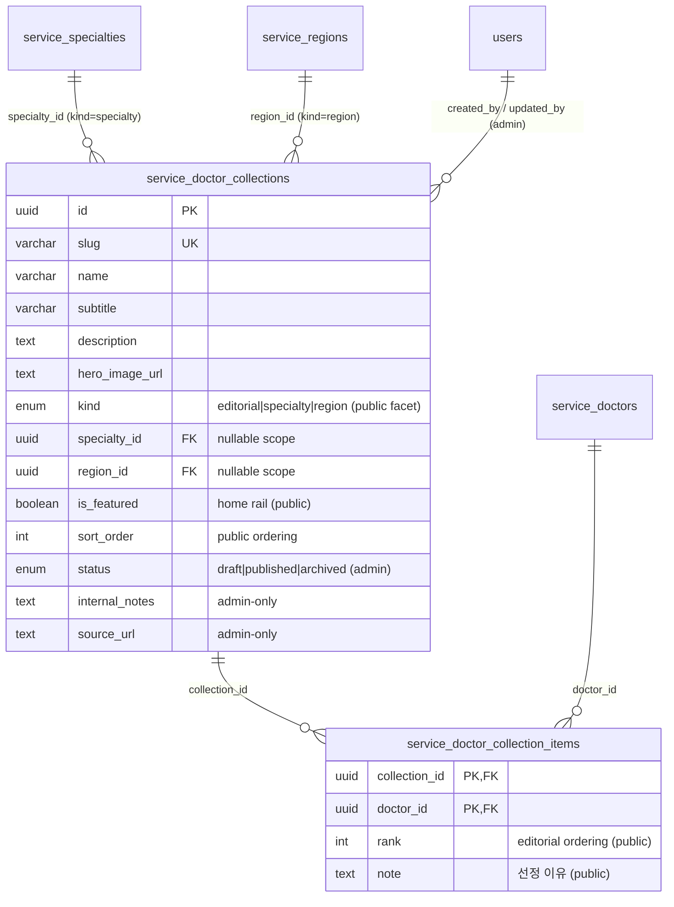

# PB-FEAT-004 — 명의 데이터 모델 (명의 큐레이션)

- Issue: `BBR-522` `[FEAT-FR-004-DATA]` · Feature card: **명의** (명의 찾기 검색·필터·정렬)
- Build: `bp-0b891299-66b7-438f-a3a4-7a63fbf8632b` · Blueprint: `온라인 서비스` (`online-service-standard`)
- Capability: `domain.feature.fr-004.data` · Decision: **NEW** · Role: Data Engineer
- Depends on: **PB-FEAT-003** (scope lock, BBR-495 done) · **PB-DATA-001** (의사/병원 큐레이션 hub, BBR-519, PR #11 merged → main `1b06ede`)
- Schema module: `packages/drizzle/src/schema/features/doctor-curation/`
- Migration: `packages/drizzle/migrations/0047_doctor_curation.sql`
- Seed: `packages/drizzle/src/seed/doctor-curation.ts` (`pnpm --filter @repo/drizzle db:seed:doctor-curation`)

## 1. Scope & boundary

Feature card **명의** = "명의 찾기" discovery: surface editorially-recognized renowned doctors with
search / filter / sort. Per the PB-FEAT-003 scope lock and the PB-DATA-001 ownership boundary
(§6 of that doc), FR-004 owns the **editorial curation layer** and **reuses** the doctor hub for the
raw browse:

| Concern | Owner | Notes |
|---------|-------|-------|
| 명의 검색·필터·정렬 (by 진료과 / 지역 / 평점 / 경력) | **REUSE** PB-DATA-001 | `service_doctors` + its indexes (`idx_service_doctors_status_specialty/region/name`, `…_status_featured_rank`); `is_featured` / `featured_rank` are the 명의 badge/ordering |
| 명의 컬렉션 / 기획전 (큐레이션 lists) | **NEW** FR-004 (this issue) | `service_doctor_collections` + `service_doctor_collection_items` |
| 의사 경력/학력/수상 (rich profile incl. awards) | FR-005 (BBR-523) | **Not here** — awards belong to the profile cluster, this module references doctors only |

> FR-004 does **not** re-implement doctor search or redefine `service_doctors`; it references the hub
> by id and adds the curation tables. This keeps the 6 feature clusters isolated as locked in BBR-495.

## 2. Resources

| Resource (table) | Korean | Kind | Owned here | References |
|------------------|--------|------|-----------|------------|
| `service_doctor_collections` | 명의 컬렉션 / 기획전 | editorial resource | ✅ FR-004 | `service_specialties`, `service_regions`, `users` |
| `service_doctor_collection_items` | 컬렉션 수록 의사 | ordered M:N | ✅ FR-004 | `service_doctor_collections`, `service_doctors` |

New enum `service_collection_kind` = `editorial` | `specialty` | `region` (public browse facet).
Publish lifecycle **reuses** the hub enum `service_publish_status` (`draft`/`published`/`archived`).

## 3. ERD

## 4. Public / Private / Admin field separation (AC#2)

Only `status = 'published'` collections (and `is_deleted = false`) are exposed publicly; a collection
item additionally surfaces only when its referenced `service_doctors` row is itself `published`
(enforced at the query layer — see §1 of the hub doc).

| Table | Public fields | Admin-only fields |
|-------|---------------|-------------------|
| `service_doctor_collections` | name, slug, subtitle, description, hero_image_url, kind, specialty_id, region_id, is_featured, sort_order | status, internal_notes, source_url, published_at, created_by, updated_by, is_deleted, deleted_at |
| `service_doctor_collection_items` | rank, note, doctor_id (→ published doctor) | — (gated by parent collection + doctor publish status) |

## 5. Index catalog → query pattern (AC#1)

| Index | Table | Serves |
|-------|-------|--------|
| `uq_service_doctor_collections_slug` | collections | public detail by slug (`/myeongui/{slug}`) + uniqueness |
| `idx_service_doctor_collections_status_featured_sort` | collections | public **명의 home rail**: published + featured in display order (verified `Index Scan`) |
| `idx_service_doctor_collections_status_kind` | collections | public browse **필터** by facet (기획/분야별/지역별) |
| `idx_service_doctor_collections_specialty` | collections | 분야별 명의 collection lookup |
| `idx_service_doctor_collections_updated_at` | collections | **admin console**: most-recently-edited first |
| `idx_doctor_collection_items_collection_rank` | items | ordered read: 수록 의사 within a collection by rank |
| `idx_doctor_collection_items_doctor` | items | reverse lookup: collections a doctor appears in ("명의 선정 이력" on the doctor page) + cascade |

(+ implicit PK indexes on `collections(id)` and `collection_items(collection_id, doctor_id)`.)

## 6. Migration & verification evidence

- **Migration** `0047_doctor_curation.sql` is hand-authored in the repo's idempotent style
  (`CREATE TYPE … EXCEPTION WHEN duplicate_object`, `CREATE TABLE/INDEX IF NOT EXISTS`,
  `ADD CONSTRAINT` in `DO` guards), consistent with `0046_service_domain`. Journal entry `idx: 47`
  appended. `drizzle-kit generate` was **not** used — same reason as 0046 (base snapshot drift).
- ⚠️ **Concurrent FR DATA clusters** (FR-001 BBR-520 user-grade, FR-003 BBR-521 search, FR-005
  BBR-523 profile) are stacking their own migrations on `0046`. If one of them merges as `0047`
  first, renumber this file + its journal entry to the next free index — the DDL is order-safe
  (idempotent, only depends on `0046`).
- Verified against an **ephemeral Postgres 16** (Docker) with a `users` stub, applying `0046` then
  `0047`:
  - migration applies clean and is **idempotent** on re-run;
  - 2 tables, `service_collection_kind` enum = {editorial, specialty, region}, 6 FKs (4 + 2), 9 indexes;
  - public projection join returns a published collection's 수록 의사 filtered to `published` doctors;
  - **featured-rail query uses `idx_service_doctor_collections_status_featured_sort` (`Index Scan`)**;
  - admin-only `internal_notes` / `source_url` decoupled from the public payload.
- `pnpm --filter @repo/drizzle check-types` passes (tsc exit 0).

## 7. Handoff

- **PB-INFRA-002** (BBR-524) owns migration proof against live Neon + connectivity; this issue
  delivers the reviewable DDL + offline verification. Apply via `pnpm --filter @repo/drizzle db:migrate`
  once the Neon branch is connected (PB-INFRA-001 / BBR-499). Run the service-domain seed before the
  curation seed (the latter references seeded doctors/specialties by slug).
- **FR-004 API cluster** (BBR-536..540) builds the public `명의 찾기` read endpoints (collections +
  reused doctor browse) and the admin curation CRUD on these tables; **FR-004 APP** (BBR-583) the UI;
  **FR-004 QA** (BBR-493). Public read paths must filter `status='published' AND is_deleted=false` and
  join only `published` doctors, selecting the public column set per §4.
