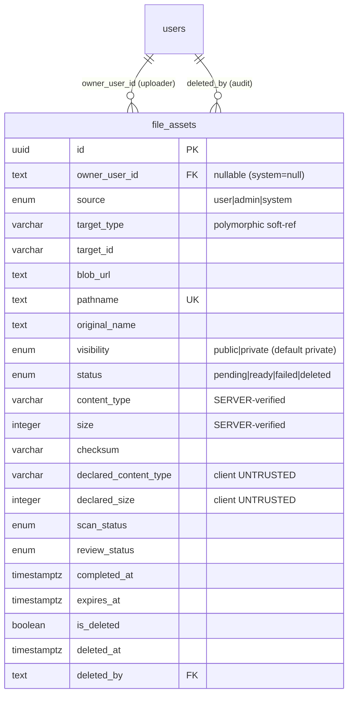

# PB-FILE-DATA-001 — 파일 metadata/권한 데이터 모델 (file_assets)

- Issue: `BBR-547` `[PB-FILE-DATA-001]`
- Build: `bp-0b891299-66b7-438f-a3a4-7a63fbf8632b` · Blueprint: `온라인 서비스` (`online-service-standard`)
- Capability: `file-upload.data-model` · Decision: **EXTEND** · Role: Data Engineer
- Depends on: PB-FILE-001 (BBR-546, scope/정책 락 ✅), PB-DATA-001 (BBR-519, schema 규약 ✅ merged)
- Schema module: `packages/drizzle/src/schema/features/file-upload/`
- Migration: `packages/drizzle/migrations/0050_file_assets.sql`
- OpenAPI: `doc/contract/PB-FILE-DATA-001-file-asset.openapi.yaml`

## 1. Scope & EXTEND boundary

파일 업로드는 Product Builder 기본 feature(Vercel Blob). PB-FILE-001 scope 문서가 access/
retention/status 정책을 락했고, 본 issue는 그 정책을 담는 **데이터 모델**을 구현한다.

base 현황: `packages/drizzle/src/schema/core/files.ts` 의 `files` 테이블은 Blob URL + 업로더만
저장한다(이미지 첨부용 최소 capability). 이는 acceptance criteria(소유자/대상/상태/서버검증/
삭제감사)를 만족하지 못한다. 따라서 base `files` 는 **건드리지 않고**(다른 feature가 참조),
풍부한 metadata/권한 전용 테이블 **`file_assets`** 를 EXTEND delta로 신설한다.

> EXTEND 원칙: base 자산(blob 헬퍼/UI primitive)은 재사용하고, 누락된 delta(메타데이터 스키마)만
> 신규 구현한다. base `files` 테이블 재작성/마이그레이션 없음.

## 2. `file_assets` 컬럼 맵 (public / owner / admin 가시성)

| 컬럼 | 타입 | 의미 | 가시성 | 근거(AC/scope) |
|------|------|------|--------|----------------|
| `id` | uuid PK | 식별자 | public | — |
| `owner_user_id` | text → users (set null) | 업로더. system 파일은 null | owner/admin | §5.3, AC1 |
| `source` | enum(user/admin/system) | 사용자 vs 관리자/시스템 구분 | admin | **AC2** |
| `target_type` / `target_id` | varchar | 연결 리소스(polymorphic soft ref) | owner/admin | §5.3, AC1 |
| `blob_url` | text NOT NULL | Vercel Blob URL | public(ready) | AC1 |
| `pathname` | text NOT NULL (unique) | Blob 저장 key | admin | — |
| `download_url` | text | 다운로드 URL 변형 | public(ready) | — |
| `original_name` | text NOT NULL | 원본 파일명(표시용) | public | AC1 |
| `visibility` | enum(public/private) = private | 접근 정책 | admin(정책) | §5.1 |
| `status` | enum(pending/ready/failed/deleted) = pending | 업로드 lifecycle | admin | §5.4, AC1/AC4 |
| `content_type` | varchar | **서버 검증** MIME | public(ready) | **AC3** |
| `size` | integer | **서버 검증** byte size | public(ready) | **AC3** |
| `checksum` / `checksum_algorithm` | varchar | 서버 계산 무결성 해시 | admin | AC3(무결성) |
| `declared_content_type` | varchar | 클라이언트 신고 MIME(**미신뢰**) | admin | **AC3** |
| `declared_size` | integer | 클라이언트 신고 size(**미신뢰**) | admin | **AC3** |
| `scan_status` | enum = pending | 악성코드/안전 스캔 상태 | admin | scope: scan state |
| `scanned_at` | timestamptz | 스캔 시각 | admin | — |
| `review_status` | enum = not_required | UGC 모더레이션 상태 | admin | scope: review state, UGC 안전 |
| `completed_at` | timestamptz | onUploadCompleted 확정 시각 | admin | §5.4 |
| `expires_at` | timestamptz | pending orphan TTL | admin | §5.4 orphan |
| `created_at` / `updated_at` | timestamptz | audit | admin | AC1 |
| `is_deleted` / `deleted_at` | soft-delete | 삭제 상태/시각 | admin | **AC4** |
| `deleted_by` | text → users (set null) | 삭제 주체(audit) | admin | AC4 audit |

## 3. ERD



`target_type`/`target_id` 는 의도적으로 **FK가 아닌 soft reference** 다. 어떤 feature(profile,
hospital, post, review…)든 자기 스키마를 이 테이블에 결합시키지 않고 파일을 붙일 수 있도록
함. 권한 검증은 API 레이어가 `target_type` 별로 수행(BBR-551 read/권한).

## 4. Trust boundary (AC3 — 클라이언트 값 미신뢰)

- 토큰 발급 시(BBR-548) 클라이언트가 보낸 MIME/size 는 `declared_content_type`/`declared_size`
  에만 저장하고 **enforcement/노출 결정에 쓰지 않는다.**
- 업로드 완료(BBR-549 `onUploadCompleted`) 후 서버가 실제 바이트로 검증한 값을
  `content_type`/`size`/`checksum` 에 저장한다(**권위값**). 권한·공개 노출·다운로드는 이
  권위 컬럼만 읽는다.
- `PublicFileAsset` projection(OpenAPI)은 권위 컬럼만 노출하며 `ready` 자산에만 적용한다.

## 5. Lifecycle & 인덱스

```text
pending(토큰 발급, declared_* 저장, expires_at 설정)
  └─ onUploadCompleted → ready (content_type/size/checksum 확정, completed_at)
  └─ 실패 → failed
ready → 소프트삭제 → status=deleted + deleted_at + deleted_by  (Blob del 은 BBR-553)
pending && now > expires_at → orphan 정리 잡 대상 (BBR-553)
```

| 인덱스 | 컬럼 | 용도 |
|--------|------|------|
| `uq_file_assets_pathname` (unique) | pathname | Blob 저장 위치 유일성 |
| `idx_file_assets_owner` | owner_user_id | 내 파일 목록 |
| `idx_file_assets_target` | target_type, target_id | 리소스 첨부 파일 조회 |
| `idx_file_assets_visibility_status` | visibility, status | 공개 전달(public+ready) |
| `idx_file_assets_status_expires` | status, expires_at | orphan 정리 |
| `idx_file_assets_scan_status` | scan_status | 스캔 큐 |
| `idx_file_assets_review_status` | review_status | 모더레이션 큐 |
| `idx_file_assets_created_at` | created_at | 관리자 콘솔 최신순 |

## 6. Acceptance Criteria 매핑

| AC | 충족 |
|----|------|
| Blob URL만 저장 X — 소유자/대상/상태/크기/MIME/삭제상태 보유 | §2 전체 컬럼; `file-assets.test.ts` AC1 |
| 사용자 업로드 vs 관리자/시스템 생성 구분 | `source` enum; AC2 테스트 |
| 클라이언트 MIME/size 미신뢰 — 서버 검증 결과 저장 | `content_type`/`size`/`checksum` vs `declared_*`; §4; AC3 테스트 |
| 삭제 파일은 감사/정리 위해 상태+deletedAt 유지 | `status=deleted` + `deleted_at` + `deleted_by`; AC4 테스트 |

## 7. Deliverables 체크

- [x] `file_assets` schema — `packages/drizzle/src/schema/features/file-upload/file-assets.ts`
- [x] target resource relation — `target_type`/`target_id` (soft ref) + owner/deletedBy relations
- [x] visibility/status enum — `enums.ts` (+ source/scan/review)
- [x] migration — `0050_file_assets.sql` (idempotent) + `_journal.json` idx 50
- [x] OpenAPI schema — `doc/contract/PB-FILE-DATA-001-file-asset.openapi.yaml`
- [x] schema-shape 테스트 8건(AC1–AC4) green; `@repo/drizzle` tsc strict green

## 8. 후속/핸드오프

- **BBR-548 (CREATE/token)**: `declared_*` 저장 + `expires_at` 설정 + `onBeforeGenerateToken`
  타입/크기 enforcement(§4, scope §5.2).
- **BBR-549 (COMPLETE)**: `onUploadCompleted` → `content_type`/`size`/`checksum`/`completed_at`
  확정, `status=ready`.
- **BBR-550/551 (LIST/READ)**: `visibility`/`status`/소유자·target 권한, 서명 URL.
- **BBR-553 (DELETE)**: soft-delete(`status=deleted`,`deleted_at`,`deleted_by`) → `deleteBlob`,
  orphan(`status=pending && expires_at<now`) 정리.
- **BBR-555 (ADMIN)**: `source`/scan/review/감사(`deleted_by`,`created_at`) 조회.
- product-builder-base 환류: base `files` 테이블과의 관계(통합/대체)는 base capability PR에서
  결정 — 본 delivery는 `file_assets` 신설로 진행하고 base `files` 는 미변경.
